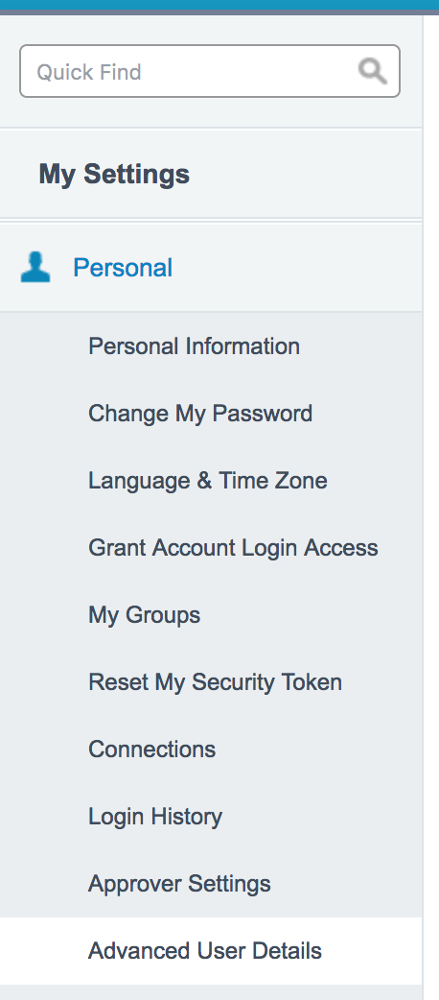
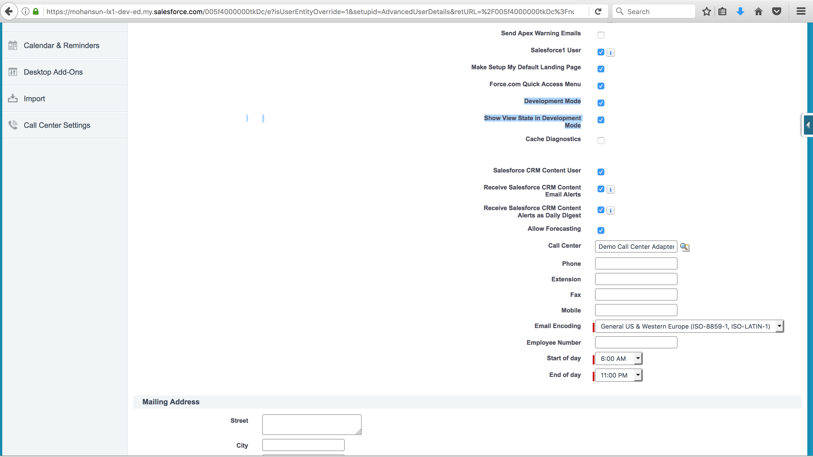

### Visualforce View State

[Ref](https://developer.salesforce.com/page/An_Introduction_to_Visualforce_View_State)

Where is the View State info stored:

Visualforce pages that contain a form component contains an encrypted, hidden form field that encapsulates the **view state** of the page. 

Purpose:

Purpose of view state is to hold the state of the page - state that includes:

- the components
- field values
- controller state

----

Why we need View State:

HTTP is a stateless protocol, which means that the initial GET and the two subsequent POSTs are treated as independent requests for the page (as shown below).

View State is used to **persist state information** across HTTP requests.

In Visualforce, page state is persisted as a **hidden form field** that is automatically inserted into a form when the page gets generated

----

How to inspect View State:

[Ref](https://help.salesforce.com/articleView?id=code_dev_console_tab_view_state.htm&type=0)

My Settings > Personal > Advanced User Details:

Since the view state is linked to form data, the View State tab only appears if your page contains an <apex:form> tag. In addition, the View State tab displays only on pages using custom controllers or controller extensions.

 
