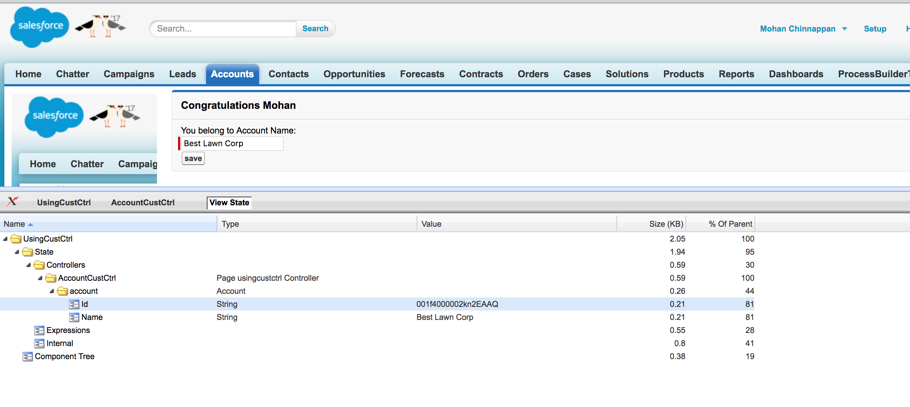
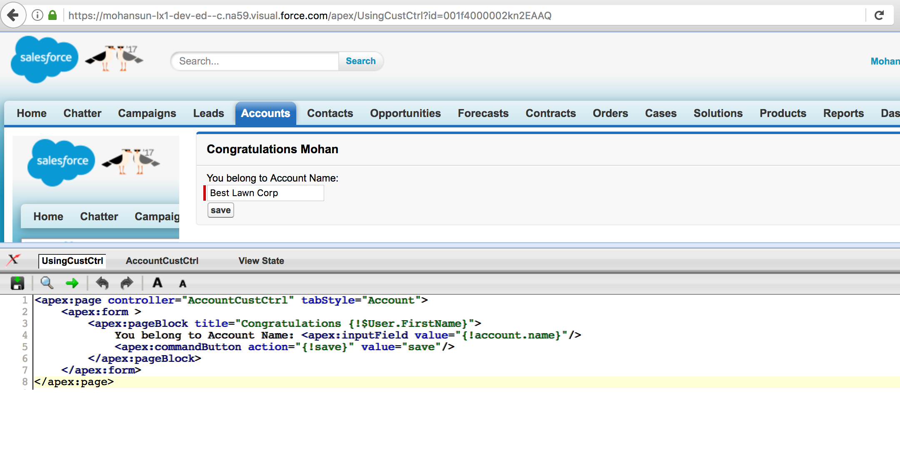
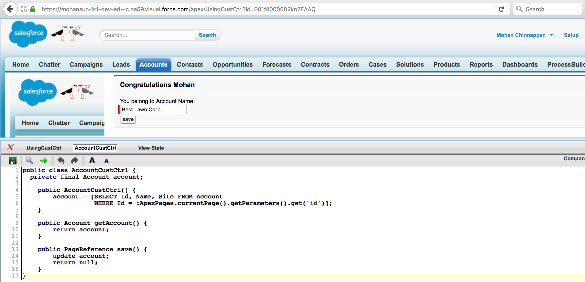

### Visualforce View State Optimization

[Ref](https://developer.salesforce.com/page/An_Introduction_to_Visualforce_View_State)

Where is the View State info stored:

Visualforce pages that contain a form component contains an encrypted, hidden form field that encapsulates the **view state** of the page. 


Purpose:

Purpose of view state is to hold the state of the page - state that includes:

- the components
- field values
- controller state

View state should ideally contain only work in progress data like:

- the current object being edited
- multi-page wizard data


View state makes developer job easier by automatically handling all the details for **state management** during HTTP POSTS.

Since the view state has to be transferred back and forth between the **browser** and **Force.com**, there could be a **potential performance impact** in terms of **increased page load times** when the view state becomes **large**. 

A smaller view state size generally means quicker load times.


Visualforce also imposes a limit of **135K** on the view state - if the view size exceeds this limit, an exception gets thrown.

Example error message:

```
Maximum view state size limit (135KB) exceeded. Actual view state size for this page was 157.109KB 

```

Tips in avoiding the View State Size errors:

- minimize the page view state
- optimize the Apex controller code
- remove any superfluous/unneeded Visualforce components used (component tree)
- An instance variable declared as transient is not saved and is not transmitted as part of the view state.
-  If a certain field is needed only for the duration of the page request and does not need to be part of the view state, declare it as **transient**. 
-  Recreate State versus Storing It in View State : If you can reconstruct the data during postback, via a SOQL query or a web services call, do that instead of storing it in controller data members.
-  Use Custom Objects or Custom Settings to Store Large Quantities of Read-Only Data. Custom settings provides a mechanism to **cache data** needed by your controller. Accessing custom settings is faster than access to custom objects since custom settings are part of your **application's cache** and does not require a database query to retrieve the data.
- Refactor Your Pages to Make Its View **Stateless**: Instead of using apex:commandLink or apex:commandButton components (which need to be inside a apex:form component) to invoke an action, **use an apex:outputLink** or other non-action method instead and implement the action through an **apex:page action attribute** - where it is possible.  
- Consider Doing Your Own State Management in Certain Cases: Use a HTML FORM instead of apex:form. This technique is useful for dealing with Visualforce pages that may have to be served to **mobile devices** where the view state may be too large for the embedded browsers.
 


About transient:

Use the **transient** keyword to declare instance variables that can't be saved, and shouldn't be transmitted as part of the view state for a Visualforce page:

```java
Transient Integer currentTotal;

```
Some Apex objects (like PageReferences, JSONParser...) are automatically considered transient.

[Ref](https://developer.salesforce.com/docs/atlas.en-us.pages.meta/pages/apex_classes_keywords_transient.htm)


Like:

- If you notice that a large percentage of your view state comes from objects used in controllers or controller extensions, consider **refining your SOQL** calls to **return only data that's relevant to the Visualforce page**.

- If your view state is affected by a large component tree, try reducing the number of components your page depends on.

[Ref](https://help.salesforce.com/articleView?id=000002955&type=1)

 Visualforce page manages a single view state, even when the page contains multiple input forms.
 


----

Why we need View State:


HTTP is a stateless protocol, which means that the initial GET and the two subsequent POSTs are treated as independent requests for the page (as shown below).

View State is used to **persist state information** across HTTP requests.

In Visualforce, page state is persisted as a **hidden form field** that is automatically inserted into a form when the page gets generated

----

How to inspect View State:

Enable View State Inspector:

[Ref](https://help.salesforce.com/articleView?id=code_dev_console_tab_view_state.htm&type=0)

My Settings > Personal > Advanced User Details:


Since the view state is linked to form data, the View State tab only appears if your page contains an <apex:form> tag. In addition, the View State tab displays only on pages using custom controllers or controller extensions.

 
---

What is in View State:
 
The data in the view state should be sufficient to **recreate the state** of the page when the HTML POST is received.

To do this, it stores the following data:

- All **non-transient** data members in the associated controller (either standard or custom) and the controller extensions.

- Objects that are reachable from a non-transient data member in a controller or controller extension.

- The **component tree** for that page, which represents the page's component structure and the associated state, which are the values applied to those components.

- A small amount of data for Visualforce to do housekeeping.


View state data is **encrypted** and cannot be viewed with tools like Firebug. 

Example:





---


 
